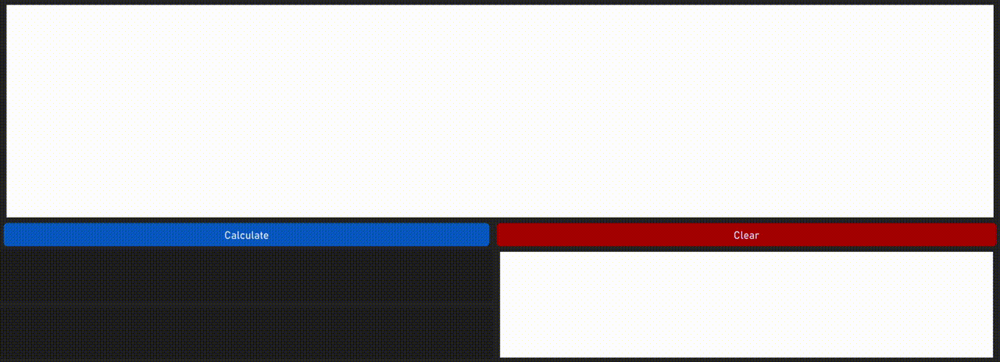
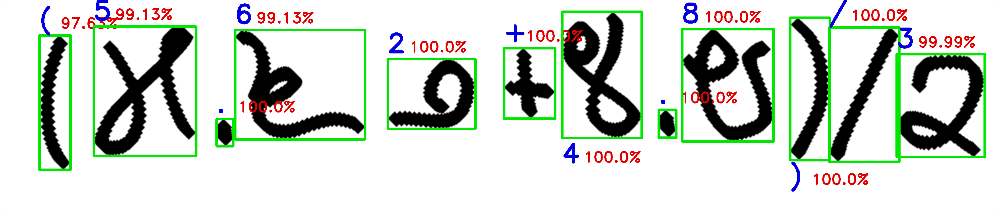

## Kannada-Handwriting-Calculator


##### Contour boxes (green), predicted classes (blue) and prediction probabilities (red)


A calculator that uses handwritten ಕನ್ನಡ (Kannada) digits and operators to calculate the result, using contour detection and ConvNet (Convolutional Neural Network) model prediction.
- PyTorch is used to create, train and load the state of the neural network model used for predictions.
- OpenCV and Pillow (PIL) are used to read input from the GUI canvas and to obtain contours for individual digits/operators.
- CustomTKinter is used to provide the GUI.
- The individual digits/operators are detected and their most probable target classes are predicted. The predictions are combined into a string and evaluated to get the result.
- `src/ConvNet.ipynb` consists of processing the data, creating the CNN model architecture and then training the model.
- `src/Main.ipynb` consists of loading the trained model state and using it to make predictions for the calculator app.

### Requirements -
```bash
conda create --name <env> --file requirements.txt
pip install customtkinter
```

### Instructions -
- Clone the repo and run the Jupyter Notebook, `src/Main.ipynb`, or `src/Main.py`.
- You can use Kannada digits `೦ ೧ ೨ ೩ ೪ ೫ ೬ ೭ ೮ ೯`, operators `+ - × /`, decimal point `.` and parentheses `()`.
- You can also use `××` for exponentiation and `//` for floor division.
- To train the model yourself, download the data, unzip, move it into `datasets` directory, and then run the Jupyter Notebook `src/ConvNet.ipynb`. 

    #### NOTE:
    Depending on your screen resolution, you may need to change canvas size, brush delta/displacement and brush thickness to get more accurate results.

### Data
* [Kannada MNIST dataset](https://www.kaggle.com/competitions/Kannada-MNIST/data)
* [Symbol dateset by Irfan Chahyadi ](https://github.com/irfanchahyadi/Handwriting-Calculator/blob/master/src/dataset/data.pickle)
